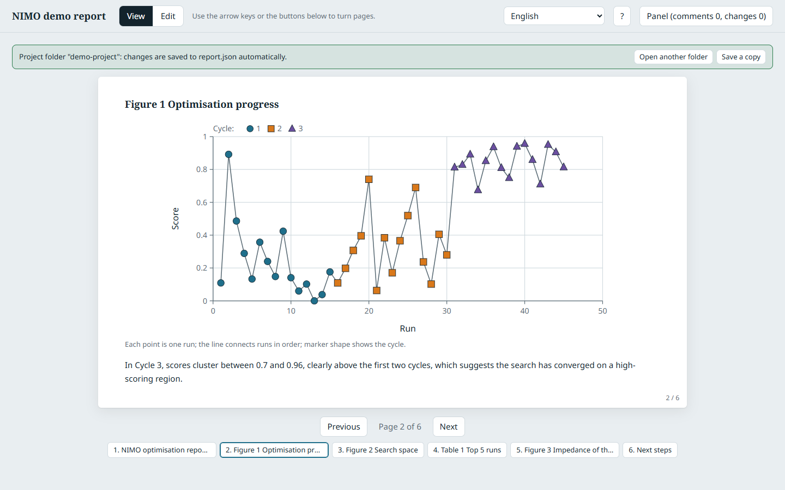
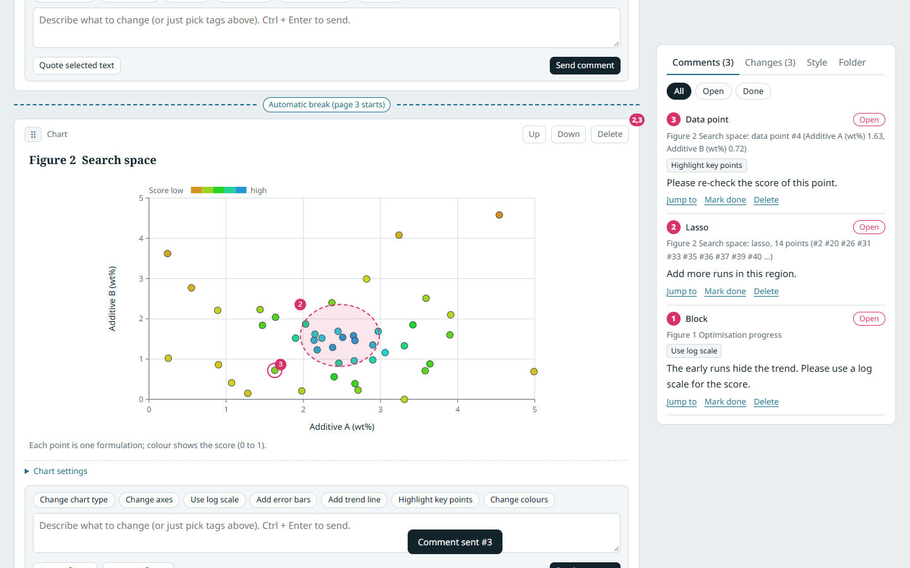
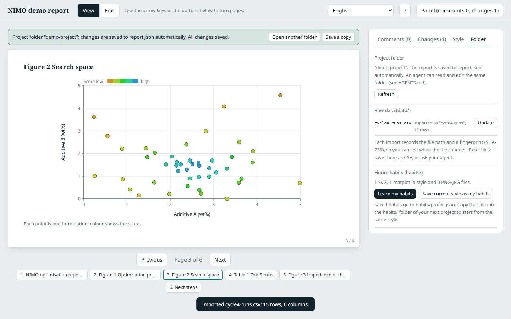
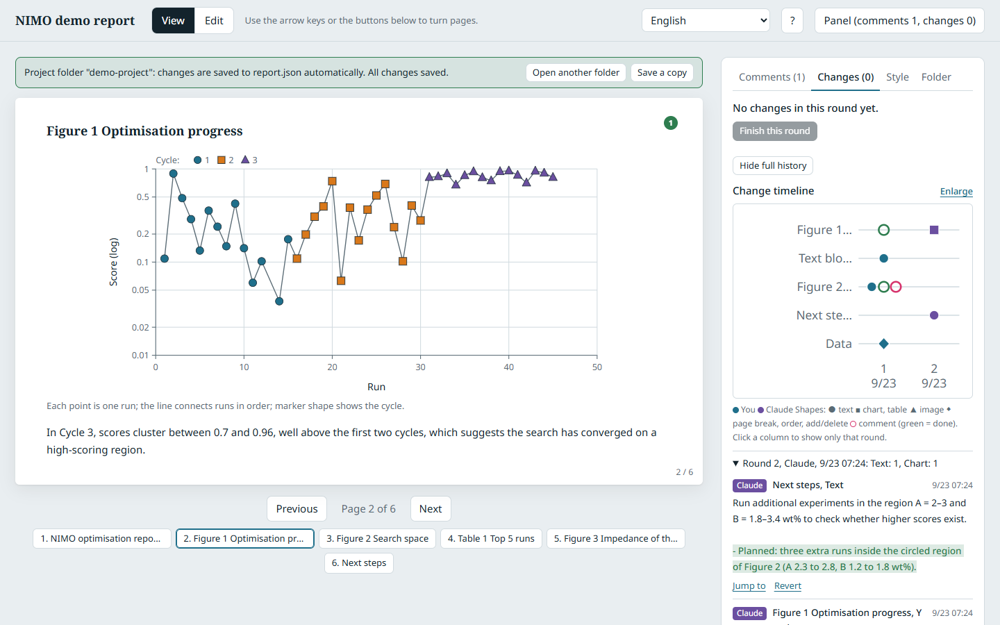
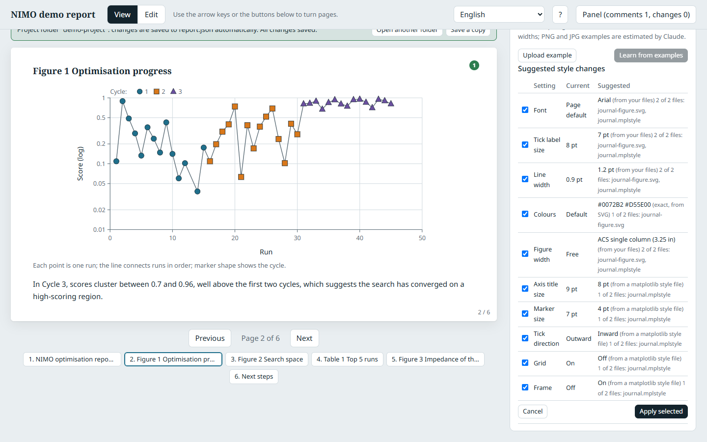

# Duetsheet

**The sheet humans and AI agents play from together, record every move on, and rerun.**

Duetsheet is an open-source, single-file interactive HTML report that people and AI agents review and revise together. You edit text and charts in place, circle what is wrong directly on a figure, and every change is recorded with who made it, so the agent (Claude, ChatGPT, Gemini, or any LLM that can read files) receives precise feedback and revises the report round after round.

It is a human-in-the-loop review tool for AI-generated, data-heavy reports: visual annotation on charts, per-block comments, change tracking with diffs, review rounds on a timeline, raw-data provenance, and a figure style that follows your own habits. One HTML file, no install, no build, no server.

Why the name: in a duet, two performers play from **one sheet of music**. In Duetsheet, a human and an AI agent work from one shared page. Sheet music is also a set of steps that gets **played** again and again, which is where this project is heading: from recording and reviewing reports, to editable workflows you can rerun and branch.

> **Status: v0.6 prototype.** Start it from Claude Code (`/duetsheet`) or with `python duetsheet.py` in your data folder, open it in Chrome or Edge and choose a folder, host it as a [Claude](https://claude.ai) Artifact, or use saved report files in any modern browser. See the [tutorial](docs/tutorial.md) and the [roadmap](#roadmap).



## Why

AI agents are good at producing reports that *look* right. The hard part is telling them precisely what is wrong.

Describing "the cluster of points in the upper left of the second figure looks off" in a chat box is vague, and after a few rounds of back-and-forth nobody knows which version is current. Duetsheet replaces the chat box with the report itself: you edit it directly, you draw on the figure, and the agent receives exact positions, data ranges, row ids and before/after values instead of a paragraph of description.

## Features

**Review**
- **View mode**: clean, paginated 16:9 pages with automatic page breaks. Mark any block as "force a new page", "keep with the previous block", or "beside the previous block", which puts a figure and its discussion side by side. A contents block lists the sections and figures with their page numbers as links. Figures shrink to fit when a page overflows.
- **Edit mode**: edit titles, text and captions in place; change chart type, dataset, axes, ranges and log scale; crop and resize images; drag blocks to reorder, or switch to **Reorder (titles only)** to see every block as one line, page by page, and drag a figure together with its discussion; add or delete blocks.
- **Visual annotation on figures**: box-select or free-hand lasso on charts and images, or click a single data point in Edit mode (in View mode, pointing at a point shows its values). A small dialog opens right there to say what should change. On charts the annotation stores the **data-space range and the enclosed data points**, not pixels, so the agent knows exactly which measurements you mean.
- **Ask the agent to revise**: one button at the top sends your comments to the agent that started the report (it waits in the background with `duetsheet.py wait`, at no cost). The page shows when the request is sent, when the agent is working and how many comments it handled, and reloads the revised report by itself. The page never calls a model: the request is only a notice, and the agent reads your comments from the report.
- **Per-block comments** with preset tags ("more concise", "add data", "use log scale", "add trend line", ...) and quotes of selected text.

**History**
- **Change log**: every edit is recorded with before and after values. Text changes are shown as inline diffs; setting changes read as sentences ("Y axis: linear → log"). Each change can be reverted on its own.
- **Rounds and timeline**: close a round of edits with one click. The timeline shows rows as report blocks and columns as rounds, with human and AI edits colour-coded.
- **Human vs. AI attribution**: edits made by the agent are recorded separately from yours.

**Data and figures**
- **Works in your data folder**: start Duetsheet in the folder with your raw data (`/duetsheet` in Claude Code, or `python duetsheet.py`) and the report opens already connected to it, with no folder to pick. The report is saved in a `duetsheet/` subfolder; raw data is only read. Your agent can edit the report while the page is open; the page reloads it and merges by document. In Chrome or Edge you can also open a folder from the page itself.
- **Raw data with provenance**: import CSV, TSV or JSON files from your data folder and its subfolders. Each dataset records the file path and its SHA-256 fingerprint, and the page tells you when the source file changed after the import.
- **Data chain, from figure to raw file**: every script run is recorded as a step (script, command, parameters, input and output files with their fingerprints). Under each chart and table a line such as *Source: cells.csv ← make_cells.py ← 72 raw files* opens the whole chain. When a raw file or a script changes, everything computed from it turns red: steps, derived files, datasets, charts. New data is found by itself: drop a new round of files into the folder and the steps whose input patterns match them turn red, with the new files listed. The Folder tab lists every derived file, raw file and script, and answers the reverse question too: click a raw file and see which charts depend on it. Large raw data is only re-read when its size or date changed.
- **Figures from any tool, with their source**: upload SVG (kept as vector) or PNG/JPEG/WebP/GIF from Origin, matplotlib, MATLAB, R, Igor Pro, Prism, Excel and others. Each image records which tool made it, the original file name, the plotting script and the raw data, so the agent knows how to regenerate it.

**Your style**
- **Style profile**: fonts, tick and axis-title sizes in points, marker size, line width, tick direction, frame, grid, colour palette, figure width presets (free, ACS single column, ACS double column), and defaults for new charts. Exportable as a matplotlib `.mplstyle` file or JSON.
- **Learn your habits**: put your own figures and `.mplstyle` files in `habits/` and click **Learn my habits**. SVG files are measured exactly; each suggestion shows which files it comes from, and nothing changes until you tick it. Save the result as `habits/profile.json` and reuse it in your next project. Agents can add suggestions from PNG figures or plotting scripts, which you confirm the same way.
- **Habit suggestions**: when you make the same chart change on three charts (for example switching to a log axis), Duetsheet offers to make it the default.

**For everyone**
- **Problems you can see**: errors and warnings stay listed under **⚠** at the top (for a broken `report.json`, with the line and column). With the launcher they also reach your agent and are saved in `errors.log`. `NaN` and `Infinity` written by Python are read as empty values instead of breaking the page, and failed saves (for example while OneDrive holds the file) are retried.
- **Six interface languages, plus your own**: English, Traditional Chinese, Simplified Chinese, Japanese, Korean and Spanish, picked from the browser language. Anyone can add a language or correct a translation from the language menu, with no code. See [docs/translating.md](docs/translating.md).
- **Read-only copies and shortcuts**: **Export read-only copy** writes one HTML file with the report and its images inside; it opens in any browser, straight into View mode, and can be sent to anyone. `python duetsheet.py shortcut <folder>` puts a desktop shortcut that opens the report with one double-click.
- **Open format**: the report is plain JSON with a published [JSON Schema](schema/report.schema.json), so any program or LLM can read, generate and validate it.









## Quick start

### With Claude Code (recommended)

You need Python 3.8 or later (nothing else to install).

1. In Claude Code in a terminal, VS Code or JetBrains, install once:
   ```
   /plugin marketplace add Ashur5457/duetsheet
   /plugin install duetsheet@duetsheet
   ```
   In the **Claude desktop app** (which cannot add plugin marketplaces), run this in a terminal instead:
   ```bash
   git clone https://github.com/Ashur5457/duetsheet.git && python duetsheet/duetsheet.py install-skill
   ```
   Updating, removing, and installing without git: [tutorial, section 0](docs/tutorial.md#0-install).
2. Open Claude Code in the folder that holds your raw data (CSV, TSV, JSON; Excel is converted by Claude) and type `/duetsheet`, or just say:
   > Start Duetsheet and write a report from the data in this folder.

   Claude reads [`AGENTS.md`](AGENTS.md), proposes a report, writes it after you agree, checks it, and starts Duetsheet. The report opens in your browser, already connected to the folder. Duetsheet keeps its files in a `duetsheet/` subfolder; your raw data is never modified.

   **Where files go.** Keep your raw data *inside* the folder you open but *outside* `duetsheet/`, in any subfolders you like. Everything computed from it goes *inside* `duetsheet/`:
   ```
   my-experiment/                the folder you open
     Data_R1/run001.xlsx         raw data: stays where it is, only read
     notes/instrument.csv
     duetsheet/                  made by Duetsheet
       report.json
       derived_data/cells.csv    tables computed from the raw data
       scripts/make_cells.py     the scripts that compute them
   ```
   Data outside the opened folder cannot be traced; move or copy it in first.
3. Review in **Edit** mode: change things directly, comment, draw on figures.
4. Click **Ask the agent to revise** at the top of the page. Claude, waiting in the background, reads your comments and revises the report; the button shows its progress. You do not need to switch back to Claude. (If no agent is listening, for example when you opened the report from a desktop shortcut, the button gives you a prompt to paste into Claude instead. You can also just tell Claude: *Read my annotations and revise the report.*)

   The page picks up Claude's changes within a few seconds. Everything it changed appears in the change log, marked as the agent's. If something goes wrong, the page reports it to Claude (and under **⚠** at the top), so Claude can fix it.

### With any other agent, or none

Start Duetsheet for your data folder yourself:

```bash
python path/to/duetsheet.py "path/to/your/data-folder"
```

It opens the report in your default browser (any modern browser). Your agent (Codex, Copilot, Gemini CLI, Cursor, a script) edits `duetsheet/report.json` in that folder, following [`AGENTS.md`](AGENTS.md), and runs `python duetsheet.py check <folder>` to validate it. Run `python duetsheet.py init-agent <folder>` once and agents that read `AGENTS.md` or `CLAUDE.md` find these instructions by themselves (it adds a marked section and keeps anything else in those files).

Without Python: open [`duetsheet.html`](duetsheet.html) in **Chrome** or **Edge**, click **Open project folder** and choose your data folder. To try the demo, choose [`examples/demo-project`](examples/demo-project). Firefox and Safari cannot open folders from the page: use the launcher, or **Save report file** and **Open report file**.

### In Claude (claude.ai)

Requirements: a [claude.ai](https://claude.ai) account where Claude can publish Artifacts with the database capability.

1. In a new Claude conversation, upload [`duetsheet.html`](duetsheet.html) and ask:
   > Publish this file as an Artifact with the `db`, `assets`, `sample` and `downloads` capabilities.
2. Open the published link. On first open, the report loads a demo (synthetic data, not experimental results).
3. To use your own content, give Claude your data and ask it to replace the demo blocks and datasets, following `AGENTS.md`.
4. Review the report in **Edit** mode, then go back to Claude, paste the Artifact link, and say:
   > Read the Duetsheet annotations and revise the report.

The [tutorial](docs/tutorial.md) walks through it step by step with screenshots.

## Use it with any AI agent

Duetsheet does not call any AI model by itself (except the optional "estimate style from PNG" in a Claude Artifact). Your agent reads and writes the report as JSON:

- [`AGENTS.md`](AGENTS.md): the data model, how to write `report.json` safely, and step-by-step tasks (revise from annotations, import data, learn figure habits, write a new report).
- [`duetsheet.py`](duetsheet.py): the launcher (`python duetsheet.py <folder>`), checker (`check <folder>`), step recorder for the data chain (`step <folder> --script ... --in ... --out ...`), agent helpers (`annotations`, `wait`, `agent-status`), desktop shortcut (`shortcut <folder>`) and pointer for other agents (`init-agent <folder>`).
- [`skills/duetsheet/SKILL.md`](skills/duetsheet/SKILL.md): the `/duetsheet` skill for Claude Code, installed as a plugin (`/plugin marketplace add Ashur5457/duetsheet`) or with `python duetsheet.py install-skill`.
- [`schema/report.schema.json`](schema/report.schema.json): the formal JSON Schema.
- [`examples/demo-project/`](examples/demo-project/): a complete project folder.
- [`llms.txt`](llms.txt): a short index for LLMs.

Prompts that work well:

> Using AGENTS.md, write a Duetsheet report from the data files in this folder. Record where each dataset came from, check it with duetsheet.py check, then start Duetsheet.

> Look at my figures in habits/ and suggest a style in style/proposal. Do not change style/profile.

> Read the open annotations in report.json. For each one, make the smallest change, record it in changes, reply under the annotation, and close your round.

## How it works

A report is not a static HTML page. The page is a fixed viewer and editor; the content lives as JSON documents:

| Collection | Contents |
|---|---|
| `report/meta` | Title and block order |
| `blocks` | Report blocks: `text`, `chart`, `table`, `image` |
| `datasets` | Data tables with their source file and SHA-256; charts and tables reference them instead of copying values |
| `annotations` | Human feedback: target (block, point, box, or lasso), tag ids, text, status, agent reply |
| `changes` | One record per edited field: before, after, who (`user` or `claude`), when |
| `rounds` | Boundaries between rounds of edits |
| `style/profile`, `style/proposal` | The figure style, and style changes suggested by an agent |
| `examples` | Example figures the style can be learned from |
| `steps` | The data chain: each script run with its input and output files (path and SHA-256), so every dataset can be traced back to raw files |

The same documents can be stored in three ways: `report.json` in a project folder, the database of a Claude Artifact, or a report file you save and open. Because the content is data, an agent can change one caption or one chart setting without regenerating the whole report, and every change stays attributable and reversible.

## Who it is for

Any workflow where **an AI drafts a data-heavy report and a domain expert must check it claim by claim**:

- Scientific data analysis and lab reports (the origin of this project: closed-loop materials experiments)
- Finance: equity research, financial analysis, audit working papers
- Engineering and manufacturing: failure analysis, quality investigations
- Consulting and market research reports
- Fact-checking and editorial review
- Incident post-mortems and design reviews

If your report is text only, a document editor's suggestion mode may be enough. Duetsheet is most useful when the report contains **charts backed by data** and every number needs to be traceable.

## FAQ

**What is Duetsheet?**
A single HTML file that shows a report made of text, charts, tables and images, lets a person edit and annotate it, records every change with its author, and stores everything as JSON that an AI agent can read and revise.

**Do I need Claude or an account?**
No. On your computer, the launcher (`python duetsheet.py`, any browser) or Chrome and Edge alone can save the report to a folder, and any agent that can edit files can work with it. Claude Code and Claude Artifacts are supported ways to use it, not requirements.

**Which AI models or agents work with it?**
Any that can read and write JSON files: Claude Code, Codex, Gemini CLI, Cursor, local models with file access, or a script. They follow [`AGENTS.md`](AGENTS.md).

**Where is my data stored?**
In your data folder (Duetsheet's own files in its `duetsheet/` subfolder), in your Claude Artifact, or in a file you save. Duetsheet has no online service and sends nothing anywhere; the optional launcher is a small program that only listens on your own computer (127.0.0.1) and needs a random token. It loads fonts from Google Fonts and one small library (SortableJS) from a CDN.

**Where should my raw data be?**
Inside the folder you open in Duetsheet, outside its `duetsheet/` subfolder, in any subfolders. Duetsheet only reads it. Tables and scripts computed from it go into `duetsheet/derived_data/` and `duetsheet/scripts/`, so every chart can be traced back to the raw files. Files outside the opened folder cannot be traced, and `duetsheet.py check` reports them as errors.

**How do I know which charts are affected when a raw file changes?**
Each chart and table shows a coloured dot for its data chain: green when every file is as recorded, red when a raw file, a script or a derived file changed. In the Folder tab, click a raw file or folder to list the derived files, datasets and charts that depend on it. `python duetsheet.py check <folder>` prints the same as warnings.

**How does the agent know which data point I mean?**
When you click a point, draw a box or a lasso on a chart, the annotation stores the data range in the chart's units and the ids of the rows inside it, not screen pixels.

**Can I use figures from Origin, matplotlib, MATLAB or R?**
Yes. Upload SVG or PNG and record the tool, the original file, the plotting script and the raw data. Box and lasso on images are stored relative to the image for now; mapping them to data coordinates is on the roadmap.

**Can it learn how I like my figures?**
Yes. Put your figures (SVG measured exactly) and `.mplstyle` files in `habits/`, click **Learn my habits**, and tick the suggestions you want. Agents can add suggestions from PNG figures and plotting scripts.

**How is it different from comments in Google Docs or Word, or from Jupyter and Quarto?**
Document comments point at text; Duetsheet comments can point at data points and regions of a chart, and the whole review history is structured data an agent can act on. Jupyter and Quarto produce reports from code; Duetsheet is where a person reviews and corrects a report together with an agent, whatever produced it.

**Is it free?**
Yes, MIT licensed.

## Limitations

- Opening a folder from the page itself needs Chrome or Edge (the File System Access API). With the launcher, any modern browser works; without either, save and open report files.
- Designed for desktop browsers.
- In a Claude Artifact, the database limits apply: roughly 256 kB per document and 5,000 documents per report. Without an asset store (report file mode), uploaded images are compressed to about 230 kB and stored inline.
- Only chart and image blocks support box and lasso annotation; text and tables support block-level comments and quotes.
- PNG/JPEG figures cannot be measured by the page: in a Claude Artifact, Claude estimates the style with a confidence per setting; elsewhere, ask your agent or use SVG.
- In a Claude Artifact the matplotlib export is saved as `duetsheet-style.mplstyle.txt` (the download allowlist has no `.mplstyle`); remove the `.txt` extension before use. In a project folder it is saved as `exports/duetsheet-style.mplstyle`.
- Excel and instrument files are not imported by the page; save them as CSV or ask your agent to convert them.
- Origin theme files (`.oth`) cannot be imported; export an SVG from Origin and put it in `habits/` instead.
- The interface language does not translate the report itself: titles, text and captions stay in the language they were written in.
- Right-to-left languages (for example Arabic or Hebrew) can be loaded as translations, but the layout stays left-to-right.

## Roadmap

Duetsheet is planned in four stages: **record and review** (today), **workflows**, **lab automation**, and **agent evaluation**.

- One-click "copy feedback for your LLM" prompt export
- Regenerate figures from their source: run the recorded Python script, or drive Origin through its Python API, so an annotation such as "use a log axis" is applied in the original tool
- Axis calibration for imported images, so box and lasso annotations on an Origin or matplotlib image are stored in data coordinates
- **Research branches**: sections of a report as a tree, each with its status (active, paused, stopped, done), built on the data chain so you can see where branches use different data or computations
- **Workflow mode**: re-run the recorded steps that need recomputing from the page (`duetsheet.py run`); fork a branch from any step to compare parameters side by side
- Agent decision trace per data point (which step, which model, what evidence)
- Connecting physical experiment steps in self-driving labs, behind explicit human approval
- Turning accumulated annotations and change logs into evaluation sets for measuring agent performance

## Contributing

Issues and pull requests are welcome, especially real-world report types, annotation needs from other fields, and translations. The Simplified Chinese, Japanese, Korean and Spanish interface texts were drafted with AI help: corrections from native speakers are very welcome.

- `duetsheet.html` is the only source file. There is no build step: edit it and open it in a browser.
- New interface text goes through `tr('English text')` and needs an entry in the translation tables. [docs/translating.md](docs/translating.md) explains how.
- Before sending a pull request, run `python tools/check.py`. It checks that code and comments are English, that the translation tables are valid, and that no interface text is missing a translation entry.

## Citation

If you use Duetsheet in research, please cite it using [`CITATION.cff`](CITATION.cff) (GitHub shows a "Cite this repository" button).

## License

[MIT](LICENSE)

---

*Keywords: Duetsheet, human-in-the-loop AI, AI agent report review, LLM feedback, interactive HTML report, single-file HTML, figure annotation, chart annotation, lasso selection, data point annotation, change tracking, diff, review rounds, provenance, data lineage, data chain, SHA-256, reproducible research, scientific workflow, matplotlib style, figure style, Claude Artifacts, Claude Code, Claude Code skill, AGENTS.md, JSON Schema, local launcher.*
