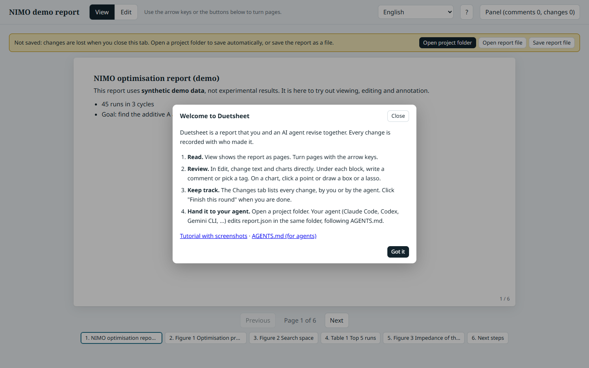
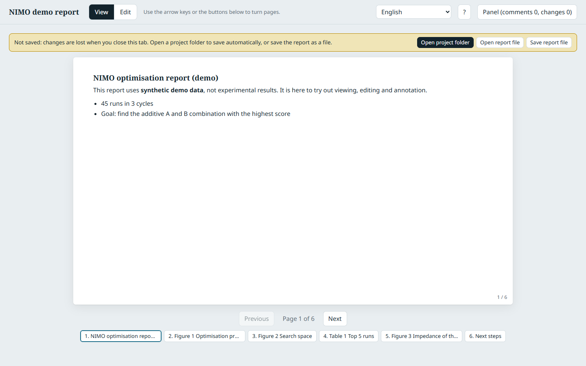
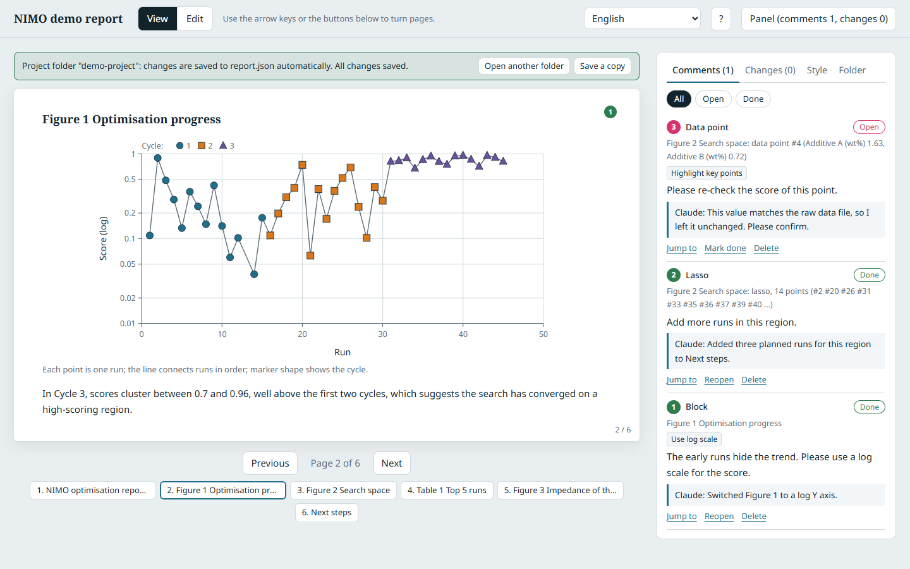
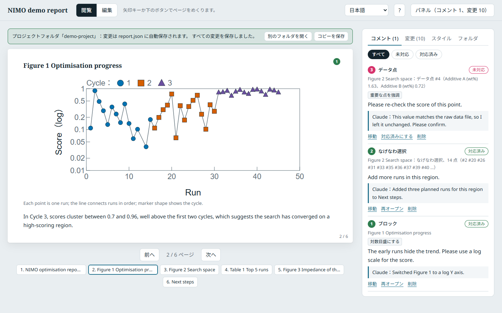

# Duetsheet tutorial

This tutorial walks through one full review cycle: open a report, bring in raw data, comment on a figure, let an AI agent revise the report, and check what it changed. It uses the demo project in [`examples/demo-project`](../examples/demo-project) (synthetic data, not experimental results).

You need Chrome or Edge on a desktop computer. No account, install or server is needed. A second path for Claude Artifacts is at the end.

## 1. Open Duetsheet

Download [`duetsheet.html`](../duetsheet.html) (or clone the repository) and open it in Chrome or Edge. The first time, a short welcome card explains the four steps. You can bring it back at any time with the **?** button.



The interface follows your browser language (English, Traditional Chinese, Simplified Chinese, Japanese, Korean or Spanish). Change it from the menu at the top right, or add your own language there ([how](translating.md)).

## 2. Open the project folder

Until you open a folder, the yellow bar reminds you that nothing is saved. Click **Open project folder** and choose `examples/demo-project` (for your own work, choose an empty folder; Duetsheet creates `report.json` in it).



The bar turns green: every change is now saved to `report.json` automatically. **View** shows the report as 16:9 pages; turn pages with the arrow keys or the buttons below.


A project folder looks like this:

```
demo-project/
  report.json      the report
  data/            raw data (CSV, TSV, JSON)
  habits/          your own example figures and .mplstyle files
  assets/          images uploaded in the page (created when needed)
  exports/         files the page exports (created when needed)
```

## 3. Bring in raw data

Open the **Folder** tab in the panel. Files in `data/` are listed with their status. Click **Import** next to `cycle4-runs.csv`.


The file becomes a dataset. Duetsheet records where it came from: the path and a SHA-256 fingerprint of the file. If the file changes later, the Folder tab says "changed since import", charts that use it show a warning in Edit mode, and **Update** imports the new version (the change log keeps both).

To plot the new data, switch to **Edit**, click **Add chart**, open **Chart settings** and pick the dataset.

## 4. Review: edit and comment

Switch to **Edit**. You can:

- change titles, text and captions directly (every change is recorded);
- change chart settings (type, dataset, columns, axis labels, range, log scale);
- drag blocks to reorder them and click the dividers to control page breaks;
- write a comment under any block, with preset tags such as **Use log scale** or **Highlight key points**.

On a chart you can point at the exact data: click **Lasso on figure** (or **Box on figure**) and draw around points, or simply click one point. The comment then stores the data range and the ids of the points inside it, which is what the agent reads.


When you have finished a batch of feedback, open the **Changes** tab and click **Finish this round**.

## 5. Let your agent revise the report

Open your AI agent (Claude Code, Codex, Gemini CLI, Cursor, ...) in the same folder and ask:

> Read AGENTS.md from the Duetsheet repository, then read the open annotations in report.json and revise the report.

[`AGENTS.md`](../AGENTS.md) tells the agent how to make the smallest change for each comment, record every change as its own, reply under each comment, and close its round. Keep Duetsheet open: within a few seconds the page reloads `report.json` and shows the agent's work.



Comments the agent handled are marked **Done** with its reply. A comment it could not settle stays **Open**, with a question for you.

## 6. Check what changed

The **Changes** tab shows the current round; **Show full history** shows every round. Text changes are shown as inline differences; setting changes read as "before → after". Each change can be reverted on its own.

The timeline has one row per block and one column per round. Filled markers are edits (blue: you, purple: the agent), circles are comments. Click a column to see only that round.


## 7. Teach it your figure style

Put figures you like in `habits/`: SVG exports from Origin, matplotlib, R or other tools, and `.mplstyle` files. In the **Folder** tab, click **Learn my habits**.

Duetsheet measures the SVG files exactly (font, sizes, line width, colours, figure width), reads the `.mplstyle` files, and lists what it found. Each suggestion shows which files it is based on; suggestions that most files agree on are ticked. Nothing changes until you click **Apply selected**.


- **Save current style as my habits** writes `habits/profile.json`. Copy it into the `habits/` folder of your next project to start from the same style.
- PNG and JPG figures cannot be measured by the page. Ask your agent to look at them: it writes its suggestions to `style/proposal`, and they appear in the Style tab for you to confirm in the same way.
- **Export** in the Style tab saves the style as a matplotlib `.mplstyle` file (`exports/duetsheet-style.mplstyle`), so your plotting scripts can use it too.

## 8. Other languages

The interface language never changes the report content or the stored data, so people working in different languages can review the same report.



## Without a folder, and in Claude

**Firefox, Safari, or no folder**: use **Save report file** to download the report (`*.report.json`) and **Open report file** to continue later. An agent can edit that file the same way as `report.json`.

**In Claude (claude.ai)**: upload `duetsheet.html` to a conversation and ask Claude to "publish this file as an Artifact with the `db`, `assets`, `sample` and `downloads` capabilities". The report is then stored in the Artifact. After reviewing, go back to Claude, paste the Artifact link and say "Read the Duetsheet annotations and revise the report." In an Artifact, the Style tab can also ask Claude to estimate your style from PNG examples.
