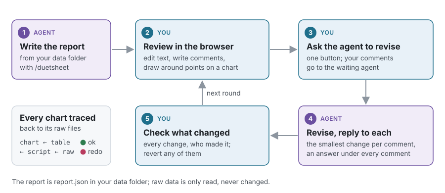
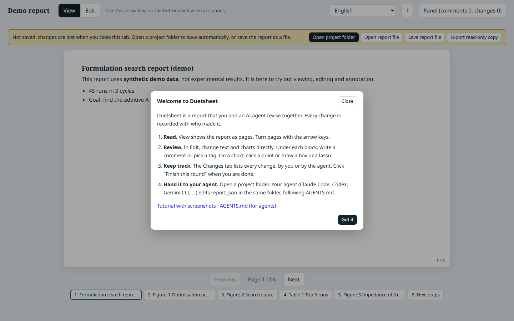
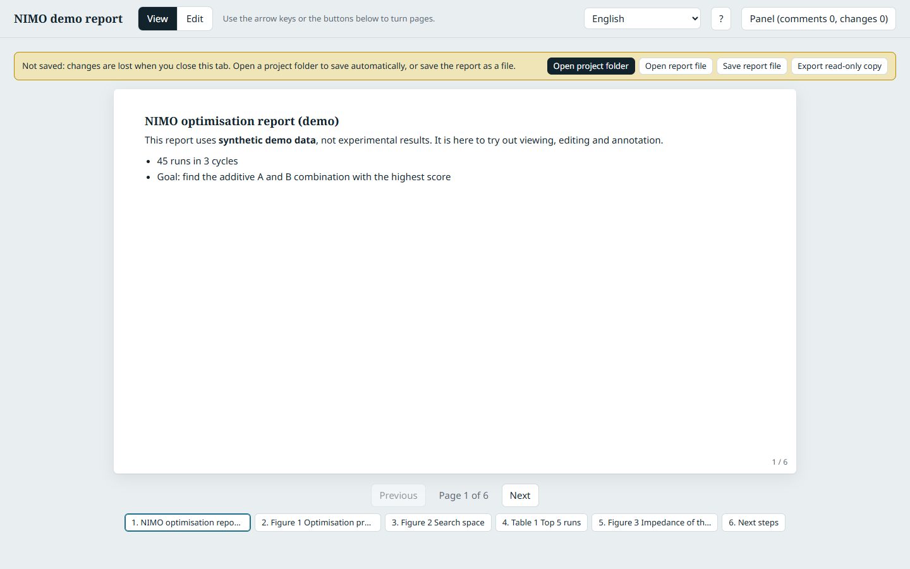
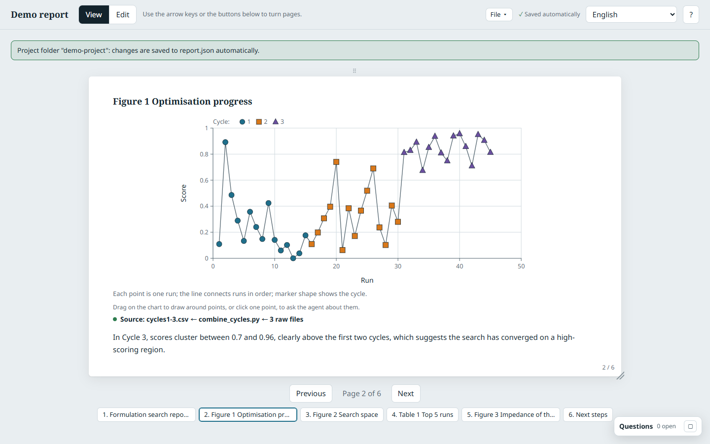
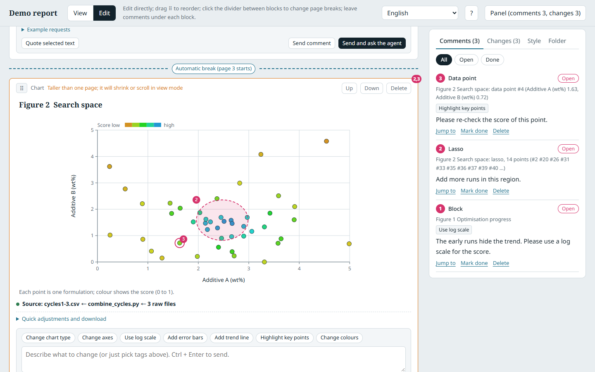
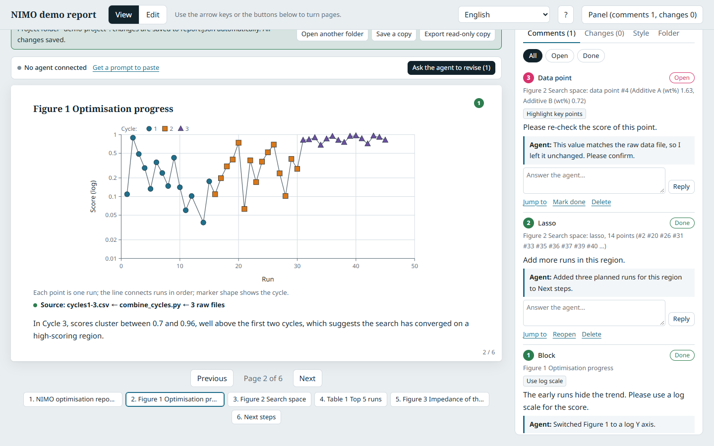
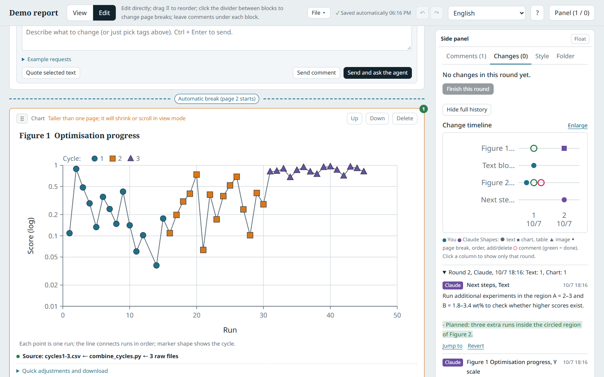
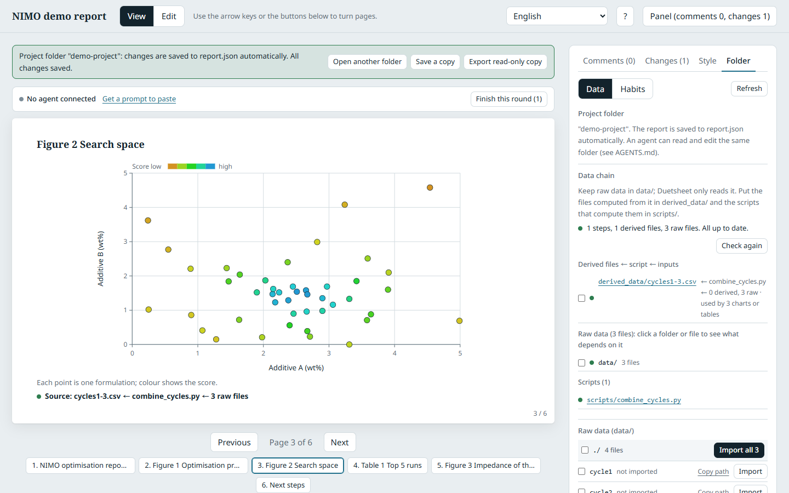
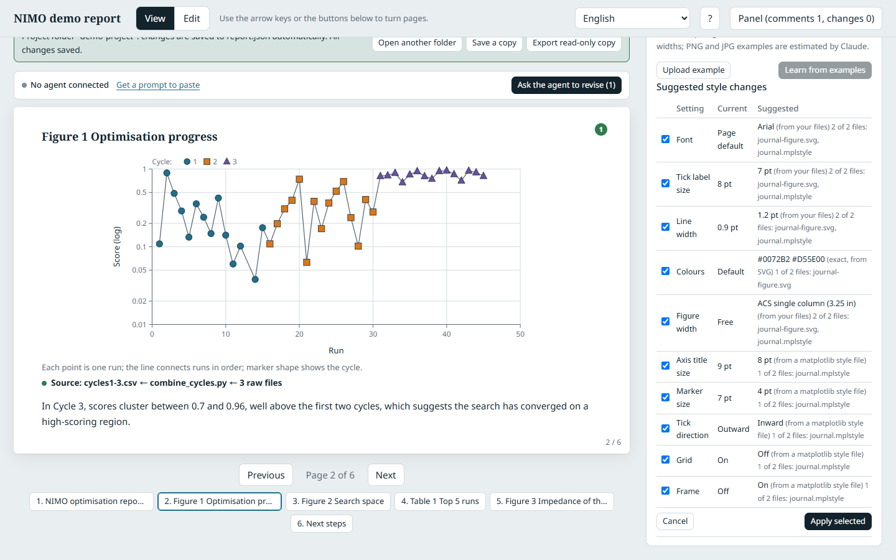
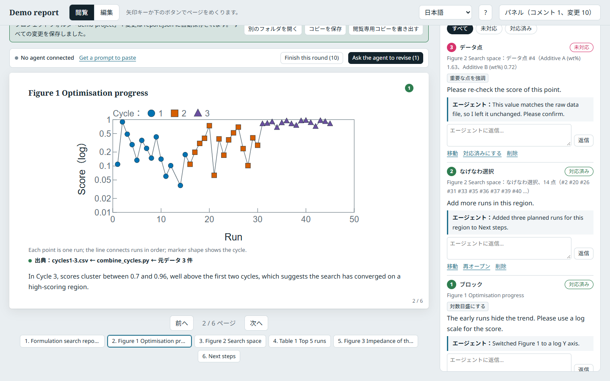

# Duetsheet tutorial

Duetsheet is a report that you and an AI agent revise together, round after round. The agent writes; you read, correct and point at what you mean; the agent revises; every change is kept with who made it.



This tutorial follows that loop once, with the demo project in [`examples/demo-project`](../examples/demo-project) (synthetic data, not experimental results):

1. [Install](#1-install) (once)
2. [Start a report](#2-start-a-report)
3. [Review: edit, comment, draw around points](#3-review-edit-comment-draw-around-points)
4. [Ask the agent to revise](#4-ask-the-agent-to-revise)
5. [Check what changed](#5-check-what-changed)

Then, when you need them: [bring in raw data and trace figures back to it](#6-raw-data-and-the-data-chain), [teach it your figure style and your writing](#7-your-figure-style-and-your-writing), [other languages](#8-other-languages), and [what to do when something goes wrong](#when-something-goes-wrong).

You need a desktop computer with Chrome or Edge.

## 1. Install

Every way of using Duetsheet on your computer needs **Python 3.8 or later**, and nothing else: no packages to install. Check with `python --version`. Duetsheet itself never calls an AI model or needs an API key: your agent reads and writes `report.json`.

### With Claude Code in a terminal, VS Code or JetBrains

In Claude Code, type these two lines once:

```
/plugin marketplace add Ashur5457/duetsheet
/plugin install duetsheet@duetsheet
```

Start a new session and type `/`: **duetsheet** is in the list.

- **Update**: `/plugin marketplace update duetsheet`, then start a new session.
- **Remove**: `/plugin uninstall duetsheet@duetsheet`.

### With the Claude desktop app, or without the plugin system

The desktop app cannot add plugin marketplaces with `/plugin`. Install the skill from a copy of the repository instead (you need [git](https://git-scm.com/)). In a terminal, in the folder where you want to keep Duetsheet:

```bash
git clone https://github.com/Ashur5457/duetsheet.git && python duetsheet/duetsheet.py install-skill
```

This installs the `/duetsheet` skill into `~/.claude/skills/`, where the desktop app, the terminal and the editor extensions all find it.

- **Update**: run `git pull` in the `duetsheet` folder, then `python duetsheet.py install-skill` again.
- **Moved the folder?** Run `python duetsheet.py install-skill` again from its new place.
- **Remove**: delete the folder `~/.claude/skills/duetsheet`.
- No git? [Download the ZIP](https://github.com/Ashur5457/duetsheet/archive/refs/heads/main.zip), unzip it, and run `python duetsheet.py install-skill` in the unzipped folder.

### With other AI agents (Copilot, Cursor, Codex, Gemini CLI, Cline and others)

These agents do not use Claude Code skills, but most of them read an `AGENTS.md` file in the folder they work in. Get Duetsheet (clone or [download the ZIP](https://github.com/Ashur5457/duetsheet/archive/refs/heads/main.zip)), then, once per data folder:

```bash
python path/to/duetsheet.py init-agent "path/to/data-folder"
```

It adds a short section to `AGENTS.md` and `CLAUDE.md` in the data folder (or creates the files) that tells any agent where the full rules are and how to check, start and listen to the report. Existing content in those files is kept: only the part between `<!-- duetsheet:start -->` and `<!-- duetsheet:end -->` belongs to Duetsheet, and running the command again only refreshes that part.

## 2. Start a report

**From Claude Code (the usual way).** Open Claude Code in the folder that holds your raw data and type `/duetsheet`. Claude reads the rules, proposes an outline, writes the report after you agree, checks it, and starts the launcher. Your browser opens the report, already connected to the folder.

**Without an agent.** Start the launcher yourself with `python path/to/duetsheet.py "path/to/data-folder"`, or open [`duetsheet.html`](../duetsheet.html) in Chrome or Edge and click **Open project folder**. To try it now, choose `examples/demo-project`.

The first time, a short welcome card explains the loop; the **?** button at the top brings it back.



Until a folder is open, a yellow bar reminds you that nothing is saved. Once it is open the bar turns green, and every change is saved to `report.json` at once.



**Where files go.** Duetsheet keeps everything it writes in a `duetsheet/` subfolder of your data folder. Your raw data must be *inside* the folder you open but *outside* `duetsheet/`; it is only read, never changed. What is computed from it goes *inside* `duetsheet/`: tables in `derived_data/`, the scripts that compute them in `scripts/`.

```
my-experiment/                the folder you open
  Data_R1/run001.xlsx         raw data: stays where it is, only read
  notes/instrument.csv
  duetsheet/                  made by Duetsheet
    report.json               the report
    derived_data/cells.csv    tables computed from the raw data
    scripts/make_cells.py     the scripts that compute them
```

If some of your data is somewhere else (another drive, your Downloads folder), move or copy it into the folder first; Claude asks you rather than doing it. (The demo project uses a simpler layout, with `report.json` at the top and the raw data in `data/`.)

**View** shows the report as 16:9 pages. Turn pages with the arrow keys or the buttons below.



**Later, without an agent**: `python path/to/duetsheet.py shortcut "path/to/data-folder"` puts a shortcut on your desktop; double-click it to open the report and keep the window that opens while you use it. To show the report to someone who has nothing installed, click **Export read-only copy** and send them the HTML file from `exports/`; it opens in any browser.

## 3. Review: edit, comment, draw around points

Switch to **Edit**. Fix small things yourself, and write down everything else for the agent.

**Fix it yourself.** Change titles, text and captions directly. **Quick adjustments and download** under a chart changes its type, axis labels, range or log scale, and downloads its data (CSV) or the chart (SVG, PNG). Drag blocks to reorder them; click the dividers between blocks to control page breaks. Every change is recorded.

**Point at the exact data.** On a chart, hold the mouse button and draw around the points you mean, as in a paint program: a line follows the mouse and closes when you let go. Or click a single point. For a rectangle, click **Box on figure** first. The comment then carries the data range and the ids of the points inside it, which is exactly what the agent reads.



**Say what to change.** Under every block there is a comment box:

- pick preset tags such as **Use log scale** or **Highlight key points**, and add words if you like;
- **Example requests** offers general sentences to start from (for example *Plot […] and […] in this chart, in different colours*), with […] for you to fill in;
- files you ticked in the Folder tab can be attached, so you never type file names;
- **Send comment** keeps it for the next round; **Send and ask the agent** sends it and asks the agent at once.

When you have finished a batch of feedback, click **Finish this round** at the top (it appears as soon as you change something), or in the **Changes** tab.

## 4. Ask the agent to revise

**With one button.** If Claude Code started the report (`/duetsheet`), it keeps listening in the background, at no cost. Click **Ask the agent to revise** at the top: it finishes your round and hands your comments to the agent. Next to the button you see *Request sent*, then *The agent is revising the report…*, then *The agent handled N comments*, and the report reloads by itself.

If no agent is listening (for example, you opened the report with a desktop shortcut), the button shows a prompt to copy and paste into your agent. Your request is kept; the agent picks it up and then keeps listening for the next one.

**By asking.** You can also open your agent (Claude Code, Codex, Gemini CLI, Cursor, ...) in the same folder and say:

> Read AGENTS.md from the Duetsheet repository, then read the open annotations in report.json and revise the report.

[`AGENTS.md`](../AGENTS.md) tells the agent to make the smallest change for each comment, record every change as its own, reply under each comment, and close its round.



Comments the agent handled are marked **Done** with its reply. A comment it could not settle stays **Open**, with a question for you. To answer, write under its reply and click **Reply**: the comment opens again, and the next **Ask the agent to revise** sends your answer.

## 5. Check what changed

The **Changes** tab shows the current round; **Show full history** shows every round. Text changes are shown as inline differences; settings read as "before → after". Each change can be reverted on its own.

The timeline has one row per block and one column per round. Filled markers are edits (blue: you, purple: the agent), circles are comments. Click a column to see only that round.



That is one round. Review again, ask again: the loop goes on until the report says what you mean.

## 6. Raw data and the data chain

**Bring in a file.** Open the **Folder** tab. Data files in the folder are listed with their status; click **Import** next to one (in the demo, `cycle4-runs.csv`). The file becomes a dataset, and Duetsheet records where it came from: the path and a SHA-256 fingerprint of the file. If the file changes later, the Folder tab says "changed since import", charts that use it show a warning in Edit mode, and **Update** imports the new version (the change log keeps both). To plot it, switch to **Edit**, click **Add chart**, open **Chart settings** and pick the dataset.



**Many files at once.** Tick files (Shift-click ticks a range; the box on a folder ticks the whole folder). A bar appears at the bottom: **Add to a chart…** or **Replace the data of a chart…** asks which chart, lets you add a note (for example *one series per round*), and creates a comment with the exact file list for your agent. **Import all** imports every file of one folder; **Show in folder** opens the file's folder in File Explorer or Finder.

**Trace a figure back.** Most report data is not a raw file: a script combines or summarises raw files into a table first. Every time your agent runs a script, it records a **step**: the script, the command, the parameters, and every input and output file with its fingerprint. Under each chart and table, a small line shows where its data comes from, for example *Source: cycles1-3.csv ← combine_cycles.py ← 3 raw files*. Its dot shows the state of the whole chain:

- **green**: every file is exactly as recorded;
- **red**: something changed or is missing (a raw file, a script, a derived table), so the figure needs recomputing;
- **grey**: not checked (for example in a read-only copy, where the files are not at hand).

Click the line to see the whole chain, down to the raw files. The Folder tab's **Data chain** overview works backwards too: open a raw data folder and click **What depends on these files?** to see which tables and charts would change if it did.

**New data.** A step remembers the patterns its inputs were found with, for example `Data/*/run*.csv`. To add a round or replace files, just put them into the folder with File Explorer or Finder; there is no path to type. The Folder tab lists them as *new, not used yet*, and the steps that should use them turn red. Ask your agent to recompute.

Raw data can be large. Duetsheet compares size and modification date first and reads a file again only when they differ. `python duetsheet.py check <folder>` reports the same states as warnings; `check --deep` reads every file.

## 7. Your figure style and your writing

The **Folder** tab has two parts: **Data** and **Habits**.

**Figures.** Put figures you like in `habits/figures/`: SVG exports from Origin, matplotlib, R or other tools, and `.mplstyle` files. Click **Learn my habits**. Duetsheet measures the SVG files exactly (font, sizes, line width, colours, figure width), reads the `.mplstyle` files, and lists what it found, each with the files it is based on. Nothing changes until you click **Apply selected**.



- **Save current style as my habits** writes `habits/profile.json`; copy it into your next project to start from the same style.
- PNG and JPG figures cannot be measured by the page. Ask your agent to look at them; its suggestions appear in the Style tab for you to confirm.
- **Export** in the Style tab saves the style as a matplotlib `.mplstyle` file, so your plotting scripts can use it too.

**Writing.** Put articles or reports you wrote in `habits/writing/` (.md, .txt, .docx, .pdf). **Measure my texts** shows plain numbers (sentence and paragraph length, lists, bold). For the rest, ask your agent: *Learn my writing style from habits/writing/.* Its suggestions (for example *Give the conclusion first, then the numbers*) appear in Folder > Habits; tick the ones to keep. Agents follow these rules whenever they write or revise text.

**Personal habits.** With the launcher, **Save as my personal habits** keeps your figure style and writing rules in `~/.duetsheet/habits/`, and **Load my personal habits** brings them into any new project.

## 8. Other languages

The interface follows your browser language (English, Traditional Chinese, Simplified Chinese, Japanese, Korean or Spanish). Change it from the menu at the top right, or add your own ([how](translating.md)). The language never changes the report content or the stored data, so people working in different languages can review the same report.



## When something goes wrong

Errors and warnings do not just flash by: a **⚠** button appears at the top right with the number of problems. Click it to see each one, with details (for a broken `report.json`, the line and column), and **Copy all** to paste them to your agent. When the launcher started Duetsheet, the same problems are printed in its output and saved in `duetsheet/errors.log`, so Claude Code sees them without you copying anything.

- **The launcher was closed** while the page stayed open: the page says so once and stops saving. Start it again (for example with the desktop shortcut) and reload the page.
- `NaN` and `Infinity` written by Python are read as empty values, with a warning.
- A save that fails because another program holds the file for a moment (OneDrive, for example) is retried until it succeeds.

## Without a folder, and in Claude

**Firefox, Safari, or no folder**: use **Save report file** to download the report (`*.report.json`) and **Open report file** to continue later. An agent can edit that file the same way as `report.json`.

**In Claude (claude.ai)**: upload `duetsheet.html` to a conversation and ask Claude to "publish this file as an Artifact with the `db`, `assets`, `sample` and `downloads` capabilities". The report is then stored in the Artifact. After reviewing, go back to Claude, paste the Artifact link and say "Read the Duetsheet annotations and revise the report."

## Going further: the whole research record

A report tells the finished story. To keep every attempt that led there, the dead ends included, as a tree you and your agent write together and can recompute, see [Duetkifu](https://github.com/Ashur5457/duetkifu). It reads the same `report.json`.
